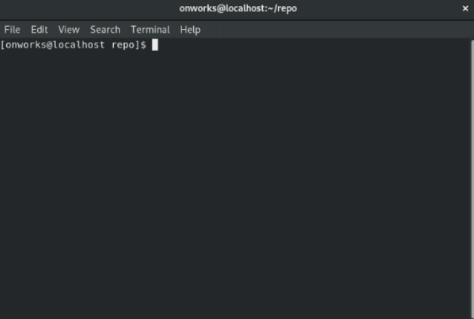

Este comando actualiza el índice utilizando el contenido actual que se encuentra en el árbol de trabajo, para preparar el contenido organizado para la próxima confirmación. Por lo general, agrega el contenido actual de las rutas existentes en su conjunto, pero con algunas opciones también se puede usar para agregar contenido con solo una parte de los cambios realizados en los archivos del árbol de trabajo aplicados, o eliminar rutas que no existen en el árbol de trabajo nunca más.

Para el ejemplo de este comando seguiremos trabajando con el archivo **.gitignore** creado anteriormente en el articulo del comando **[git-status](../git-status)**.

``` bash
#!/usr/bin/bash

git add .gitignore
```

Debe tener en cuenta que este comando tiene opciones, algunas de estas son:

``` bash
#!/usr/bin/bash

# Actualice el índice no solo donde el árbol de trabajo tiene un archivo que 
# coincide con <pathspec> sino también donde el índice ya tiene una entrada. 
# Esto agrega, modifica y elimina las entradas de índice para que coincidan con el árbol de trabajo.

# Si no se proporciona <pathspec> cuando se usa la opción -A, todos los archivos en todo el árbol de trabajo se actualizan  
# (las versiones antiguas de Git se usan para limitar la actualización al directorio actual y sus subdirectorios).
git add -A, --all, --no-ignore-removal

# Permitir agregar archivos que de otro modo se ignorarían.
git add -f, --force

# Agregue contenido modificado en el árbol de trabajo de forma interactiva al índice. 
# Se pueden proporcionar argumentos de ruta opcionales para limitar la operación a un subconjunto del árbol de trabajo.
git add -i, --interactive
```

#### Ejecucion en una terminal:    



