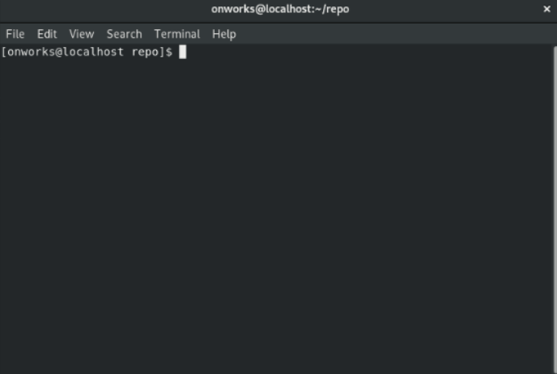
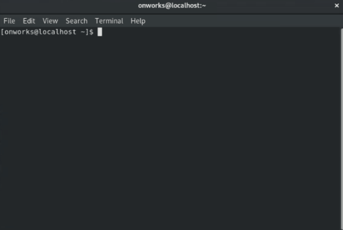

Para este aritículo continuarémos trabajando con el repositorio que se creó en el artículo **[Cómo crear un repsoitorio en Github](../../como-crear-un-repositorio-en-github)**.

Los pasos a seguir son los siguientes:

1. Eliminaremos la carpeta que creamos en el artículo del comando **[git init](../git-init)**. 
Asegurate de estar en el directorio que contiene la carpeta llamada **repo**, en mi caso me encuentro ubicado en este directorio.


    ``` bash
    #!/usr/bin/bash

    rm -rf repo
    ```
    &nbsp;

    

    &nbsp;

2. Ahora clonaremos el repositirio que creamos en el artículo **[Como crear un repositorio en Github](../../como-crear-un-repositorio-en-github)**. Para este paso debes ir a Github y ubicar en el repositorio la url de este.

    

3. Ahora ejecutaremos el comando **git clone \<url_repo\>** para clonar el repositiorio.

    ``` bash
    #!/usr/bin/bash

    git clone https://github.com/yrrodriguezb/Repo.git
    ```
    &nbsp;

    

    Listo, ya tenemos clonado el repositorio en nuestro equipo.
&nbsp;