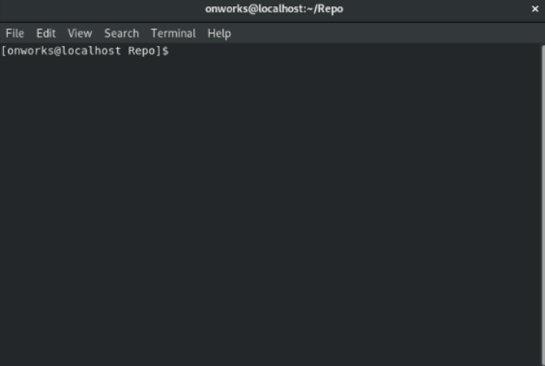

Almacena el contenido actual del índice en una nueva confirmación junto con un mensaje de registro del usuario que describe los cambios.

El contenido que se agregará se puede especificar de varias maneras:

1. Mediante el uso de **[git add](../git-add)** para "agregar" incrementalmente los cambios al índice antes de usar el comando commit.

2. Usando **[git rm](../git-rm)** para eliminar archivos del árbol de trabajo y el índice.

3. Utilizando el modificador -a con el comando commit para "agregar" automáticamente los cambios de todos los archivos conocidos (es decir, todos los archivos que ya figuran en el índice).

Para el ejemplo de este comando seguiremos trabajando con el archivo **.gitignore** creado anteriormente en el articulo del comando **[git-status](../git-status)**. Ademas crearemos otro archivo llamado **README.md**, el cual es utilizado para describir los requerimientos, dependencias, caracteristicas, etc del repositorio. 

``` bash
#!/usr/bin/bash

echo "# Repo" >> README.md
git status

git add -A
git commit -m "Commit Initial"
```

Debe tener en cuenta que este comando tiene opciones, algunas de estas son:

``` bash
#!/usr/bin/bash
 
# Dígale al comando que organice automáticamente los archivos que han sido modificados y eliminados, 
# pero los archivos nuevos que no le ha dicho a Git no se ven afectados.
git commit -a, --all

# Asigna el mensaje de confirmación.
git commit -m, --message
```

&nbsp;
#### Ejecución en una terminal:    

