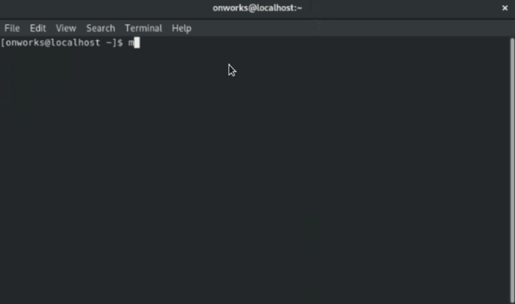

Este comando se usa para inicializar un nuevo repositorio con git.

Para este ejemplo crearemos una carpeta llamada "repo" y dentro de ella inicializamos el repositorio con el siguiente comando:   

``` bash
#!/usr/bin/bash

mkdir repo && cd repo
git init
```
#### Ejecucion en una terminal:    

