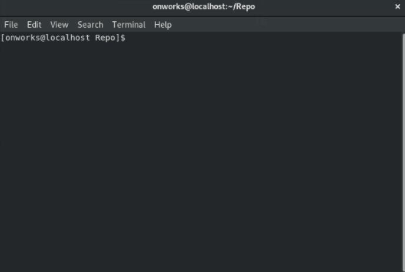

Muestra los registros de confirmación.

``` bash
#!/usr/bin/bash

git log
```

Debe tener en cuenta que este comando tiene opciones, algunas de estas son:

``` bash
#!/usr/bin/bash
 
# Continúe enumerando el historial de un archivo más allá de los cambios de nombre. 
# Funciona solo para un solo archivo.
git log --follow

# Esta es una abreviatura de "--pretty=oneline --abbrev-commit" que se usan juntos
git log --oneline
```

&nbsp;
#### Ejecución en una terminal:   

