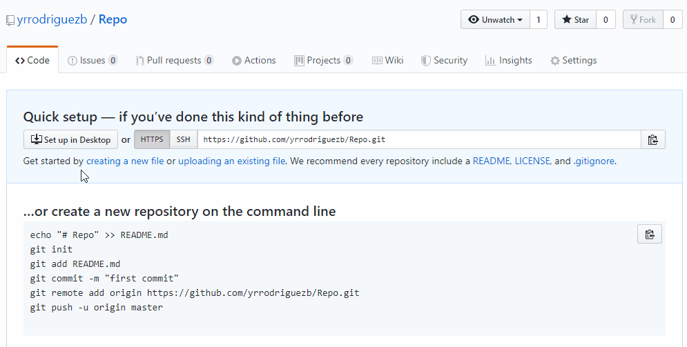
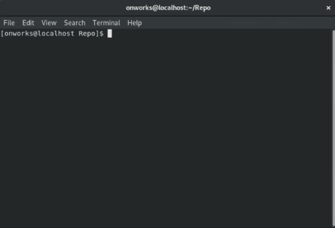
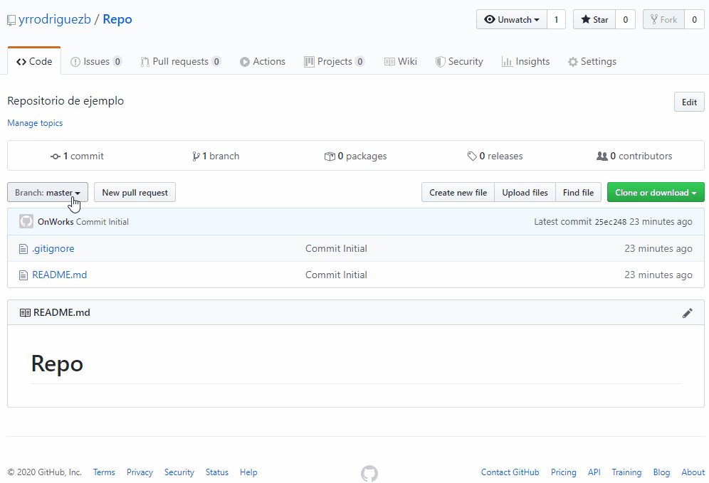

Actualiza las referencias remotas utilizando referencias locales, mientras envía los objetos necesarios para completar las referencias dadas.

Ejemplo: git push \<alias-origen\> \<rama\>

``` bash
#!/usr/bin/bash

git push origin gh-pages
git push origin master
git push heroku master
git push --tags
```

Debe tener en cuenta que este comando tiene opciones, algunas de estas son:

``` bash
#!/usr/bin/bash
 
# Empuje todas las ramas.
# Es decir, referencias debajo refs/heads/; no se puede usar con otras <refspec>.
git push --all

# Todas las referencias bajo refs/tagsson empujadas, 
# Además de las especificaciones explícitamente escritas en la línea de comando.
git push --tags

# Para cada rama que esté actualizada o que se haya enviado correctamente, 
# agregue una referencia ascendente (seguimiento), utilizada por git-pull sin argumentos y otros comandos. 
git push -u, --set-upstream

# Para mas información ejecute el comando 
git push --help
```

Para este ejemplo utilizaremos el repositorio creado en artículo **[Como crear un repositorio en Github](../../como-crear-un-repositorio-en-github)**.

1. Ubica tu repositorio remoto en **[Github](https://github.com/)**, veras una imagen como esta:

    

2. Verifica tu repositorio local no tenga nungun cambio pendiente, el cual clonamos en el artículo del comando **[git clone](../git-clone)**, ejecuta **[git status](../git-status)**.

    ``` bash
    #!/usr/bin/bash

    git status
    ```

    Ahora verifcar que nuestra rama remota quede con los cambios que tenemos en el repositorio local, ejecuta el siguiente comando en un terminal:

    ``` bash
    #!/usr/bin/bash

    git push origin master
    ```
    &nbsp;

    .

3. Verifica que tus cambios hayan quedado corretamente en el repositorio remoto, deberia verse como en la siguiente imagen.

    .

    Aqui puedes encontrar y verificar el commit que realizamos en el artículo del comando **[git commit](../git-commit)**.