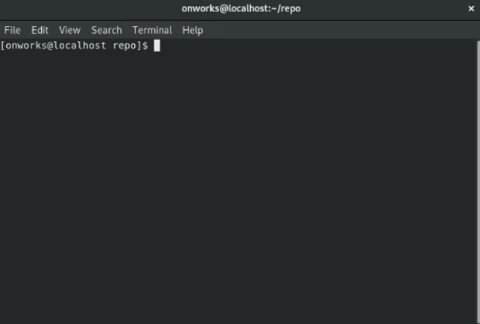

Muestra rutas que tienen diferencias entre el archivo de índice y la confirmación HEAD actual, rutas que tienen diferencias entre el árbol de trabajo y el archivo de índice, y rutas en el árbol de trabajo que Git no rastrea (y gitignore no ignora).

Los primeros son lo que podría comprometer mediante la ejecución **[git commit](../git-commit)**; el segundo y el tercero son lo que podría cometer ejecutando **[git add](../git-add)** antes de ejecutar **[git commit](../git-commit)**.

Para el ejemplo de este comando debemos tener previamente un archivo ya creado, para este caso el archivo creado es el **.gitignore**. 

``` bash
#!/usr/bin/bash

touch .gitignore
```

Una vez creado este archivo ejecutaremos el siguientes comando:

``` bash
#!/usr/bin/bash

git status
```

Debe tener en cuenta que este comando tiene opciones, algunas de estas son:

``` bash
#!/usr/bin/bash

# Da la salida en formato corto.
git status -s, --short

# Da la salida en formato largo. Este es el valor predeterminado.
git status --long

# Muestra la información de la rama en formato corto.
git status -b, --branch
```

&nbsp;
#### Ejecucion en una terminal:    

