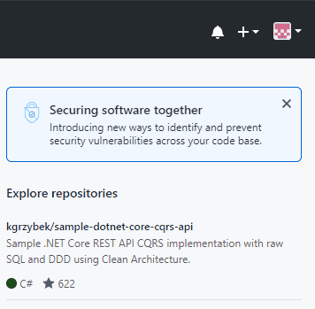
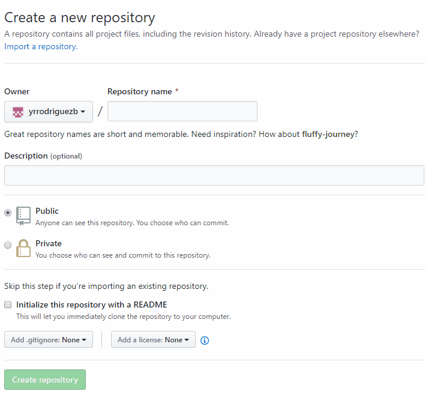
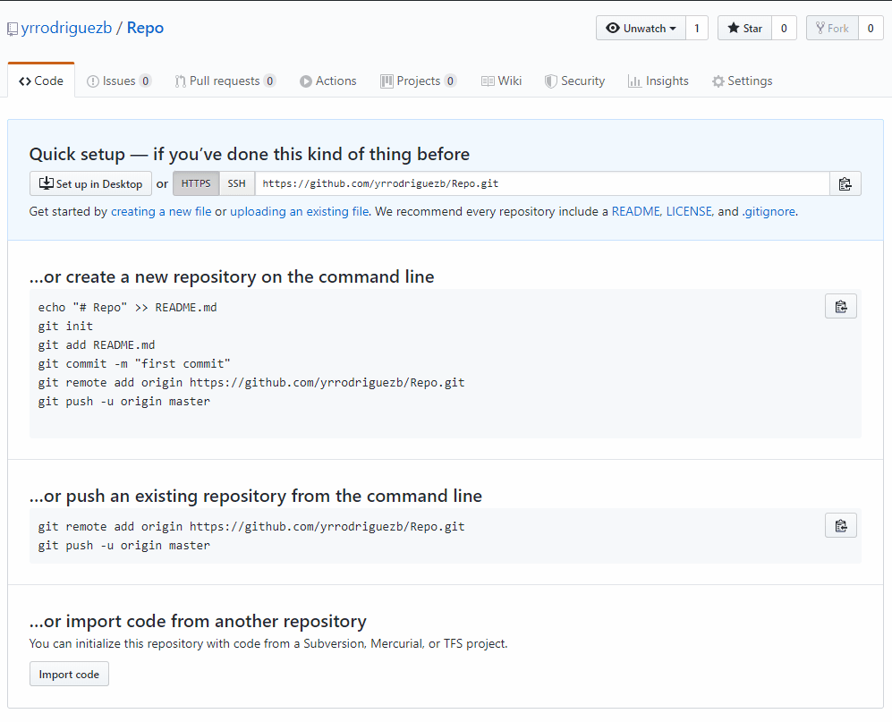

En este articulo se explicara la manera de crear un repositorio en github.

Para esto recuerda que debes tener una cuenta, si aun no la tienes debes **[Registrarte en github](https://github.com/)**. Seguido esto, debemos realizar los siguientes pasos:

1. En la parte superior derecha hay un icono de "mas" y luego en "New repository".

    

    **Imagen** ***Crear un nuevo repositorio***

2. Después de eso, vamos a poner el nombre de nuestro repositorio, el que deseemos, pondremos una descripción, le vamos a poner público o privado de acuerdo con lo que requerimos, para este caso lo dejaremos como publico para que los demás puedan verlo y finalmente damos clic en el boton "Create repository"

    

    **Imagen** ***Configuración del repositorio***

3. Seguidamente, dependiendo de si quieres que tu repositorio se inicie vacío, o quieres que se inicie con archivo que describa más a fondo el repositorio debes usuar el archivo usualmente para eso **README.md**.

    

    **Imagen** ***Repositorio creado***

4. Finalmente, ya tienes tu cuenta en **[Github](https://github.com/)** con un repositorio creado, más adelante veremos cómo puedes subir datos a tu nuevo repositorio.

