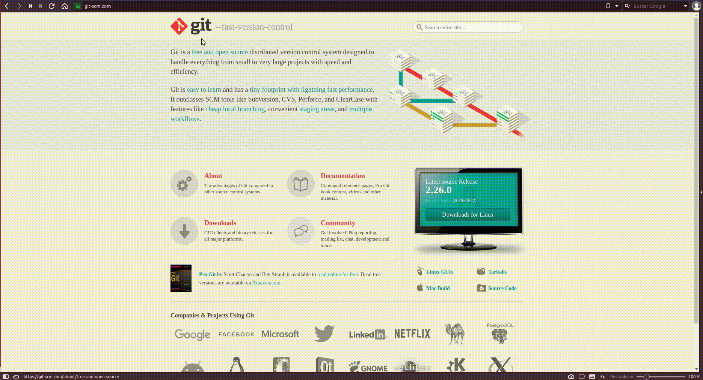

**[Git](https://git-scm.com)**, es un software de control de versiones diseñado por Linus Torvalds.

Fue creado pensando en la eficiencia y la confiabilidad del mantenimiento de versiones de aplicaciones cuando éstas tienen un gran número de archivos de código fuente, es decir Git nos proporciona las herramientas para desarrollar un trabajo en equipo de manera inteligente y rápida y por trabajo nos referimos a algún software o página que implique código el cual necesitemos hacerlo con un grupo de personas.

Algunas de las características más importantes de Git son:

* Rapidez en la gestión de ramas, debido a que Git nos dice que un cambio será fusionado mucho más frecuentemente de lo que se escribe originalmente.
* Gestión distribuida; Los cambios se importan como ramas adicionales y pueden ser fusionados de la misma manera como se hace en la rama local.
* Gestión eficiente de proyectos grandes.
* Realmacenamiento periódico en paquetes.

**[Github](https://github.com)** es un servicio para alojamiento de repositorios de software gestionados por el sistema de control de versiones Git. Por tanto, Git es algo más general que nos sirve para controlar el estado de un desarrollo a lo largo del tiempo, mientras que Github es algo más particular: un sitio web que usa Git para ofrecer a la comunidad de desarrolladores repositorios de software. En definitiva, Github es un sitio web pensado para hacer posible el compartir el código de una manera más fácil y al mismo tiempo darle popularidad a la herramienta de control de versiones en sí, que es Git.

